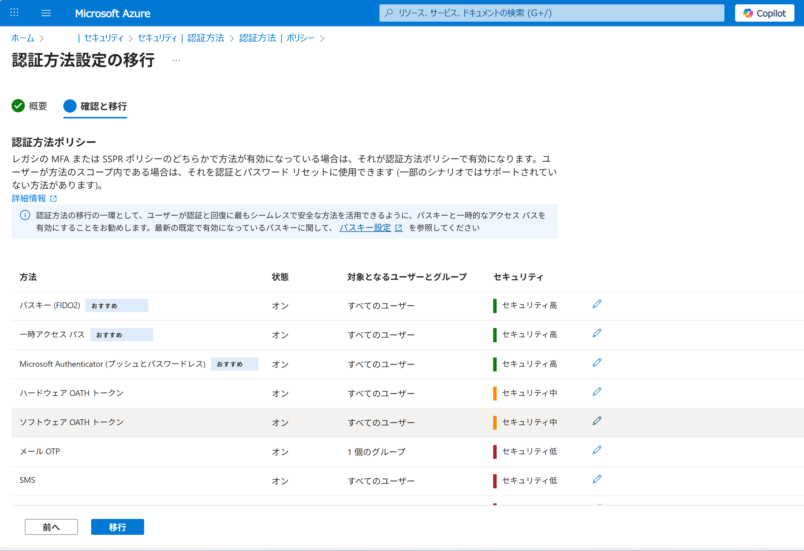
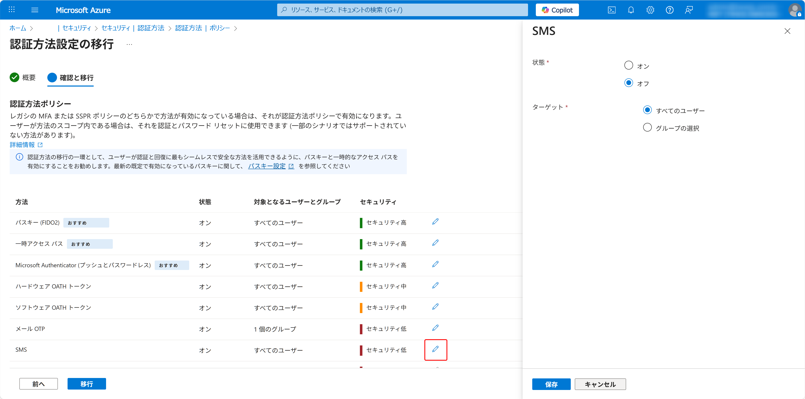
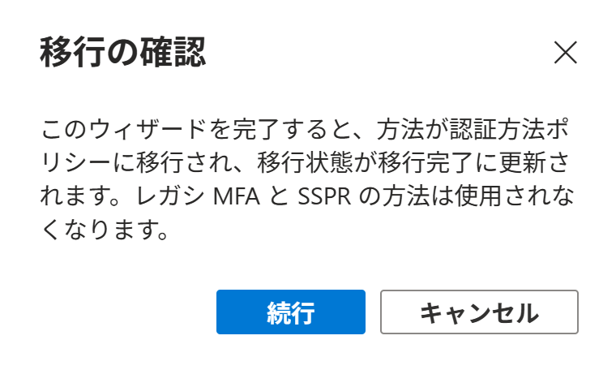
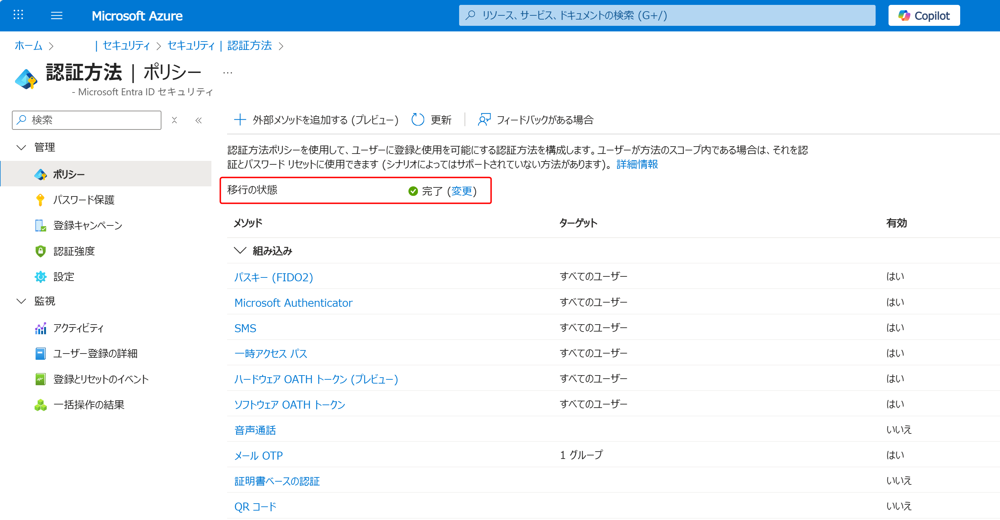
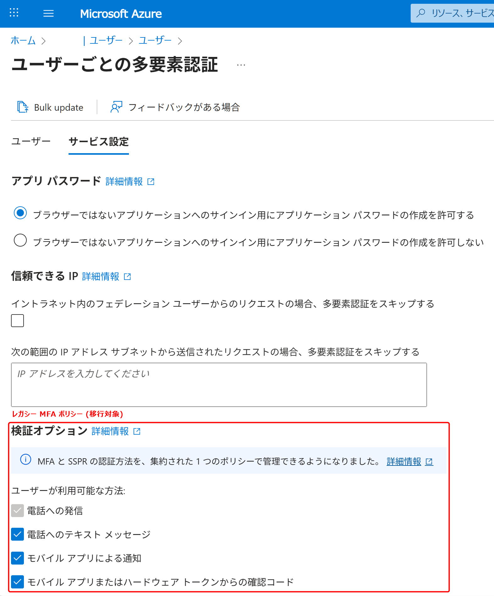
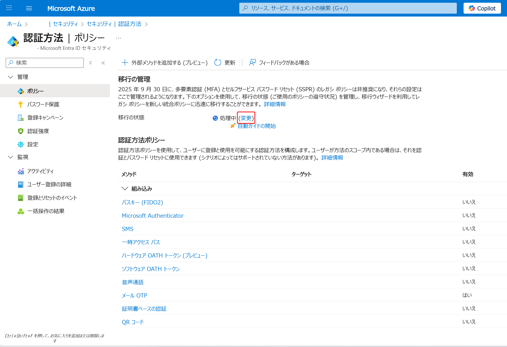

# MFA と SSPR を新しい認証方法ポリシーに移行する方法

> [!NOTE]
> 2023 年 9 月 29 日更新: レガシーポリシーが非推奨となる期日について情報を更新しました。
> 2024 年 1 月 23 日更新: Azure AD から Microsoft Entra ID への名称変更を反映し、一部画像を更新しました。
> 2025 年 9 月 17 日更新: 自動移行ガイドについて追記し、FAQ 一部画像について情報を更新しました。
> 今後も情報が更新される可能性があります。情報の更新がありましたら本ブログの内容も更新します。

こんにちは、Azure & Identity サポート チームの田辺です。

今回は、Microsoft Entra ID (Azure AD) における認証方法ポリシーの移行方法についてご紹介します。これまで MFA (Multi-Factor Authentication) と SSPR (Self Service Password Reset) で利用可能な認証方法はそれぞれ個別の画面で別々に管理されていました。現在これら別々の管理画面はレガシーな管理方法として扱われており、今後、この 2 種類のレガシー ポリシーを統一した、新しい認証方法ポリシーにて一元管理することが必要となっています。

レガシーな MFA と SSPR 用のポリシーは **2025 年 9 月 30 日** に非推奨となり、この期日までに新しい認証方法ポリシーに移行いただく必要がございます。適切に移行いただければ、現在と動作に変わりはなく、また今後よりきめ細かい制御も可能となります。

レガシー MFA と SSPR のポリシーの確認方法および新しい認証方法ポリシーへの移行方法につきましては、[MFA と SSPR のポリシー設定を Microsoft Entra ID の認証方法ポリシーに移行する方法](https://learn.microsoft.com/ja-jp/entra/identity/authentication/how-to-authentication-methods-manage) の公開情報にまとめられておりますのでご覧ください。

本ブログ記事では、上記の公開情報で案内されている認証方法ポリシーの移行方法と、よくあるご質問について情報をおまとめいたしました。2025 年 9 月 30 日が近づきますと、移行が差し迫り混乱が予想されますので、可能な限り速やかに下記対応を実施することをお勧めいたします。

なお、移行作業は 3 段階に分かれており、それぞれの段階は数十分から 1 時間程度で完了可能と思われます。移行中にダウンタイムが生じることはありませんし、適切に構成いただければ、基本的にユーザー影響が生じることもありません。万が一、予期せぬ動作が生じた際には設定を切り戻すことも可能です。

## 移行の要否

認証方法ポリシーの移行の要否について、まずは以下の項目をご確認ください。

1. Azure Portal (https://portal.azure.com) > [Microsoft Entra ID] > [セキュリティ] > [認証方法] > [ポリシー] に移動します。

2. 移行の状態が [開始していません] か [処理中] の場合、移行が必要です。
   移行の状態が [完了] の場合または移行の管理の項目が表示されない場合、移行は完了していますので、追加の対応は不要です。

移行が必要な場合について、2025 年 9 月現在、移行の方法は自動移行ガイドおよび手動移行の 2 種類がございます。

A 自動移行ガイド
B 手動移行

それぞれについてご案内します。

## A 自動移行ガイド
自動移行ガイドでは、ウィザードを進めていただくことで、レガシー ポリシーで設定されている内容を自動で有効化し、移行を完了することができます。

詳細な手順について、ご案内します。

1. Azure Portal (https://portal.azure.com) > [Microsoft Entra ID] > [セキュリティ] > [認証方法] > [ポリシー] に移動します。
2. 以下画面内の [自動ガイドの開始] をクリックします。
   

3. ウィザードの最初のページでは、認証方法ポリシーの移行の説明、およびレガシー ポリシーや公開情報へのリンクが表示されます。
   

4. [従来の MFA 方式の設定] のリンクからレガシー MFA ポリシーの設定に、[従来の SSPR 方式の設定] のリンクからレガシー SSPR ポリシーの設定に遷移できます。それぞれのポリシーの設定内容を確認ください。

5. [次へ] をクリックすると、現在、テナントのレガシー MFA ポリシーとレガシー SSPR ポリシーで有効にしている方法に基づいて、認証方法ポリシーの構成案が表示されます。いずれかのレガシー ポリシーで認証方法が有効になっている場合、認証方法ポリシーでも有効にすることをお勧めします。この構成のまま移行を完了されますと、ユーザーはこれまでに使用していたものと同じ認証方法を使用して、MFA および SSPR が実行可能な動作が想定されます。注意点といたしまして、これまでレガシー ポリシーで管理できなかった、パスキー(FIDO2)、一時アクセス パス、Microsoft Authenticator などの Microsoft が推奨する最新の認証方法は既定ではオンの状態で表示されています。
   

6. 表示されている認証方法を、お客様の要件に合わせて編集することも可能です。もし編集する場合は、各方法の横にある鉛筆アイコンを選択し、編集して保存します。
    

7. 表示されている構成に問題が無ければ、[移行] を選択して移行を実施します。以下の画面が表示されたら、[続行] を選択します。認証方法ポリシーは、ウィザードで指定された構成と一致するように自動で更新され、レガシー MFA ポリシー、レガシー SSPR ポリシーはグレーアウトされ、適用されなくなる動作になります。
    

8. 移行の状態が [完了] になったら移行の完了です。
    

## B 手動移行
自動移行ガイドではなく、お客様のご要件に合わせて、認証方法を一つずつ手動で移行することもできます。

詳細な手順について、ご案内します。

## B-1. 開始する前の確認事項

はじめに、お客様のテナントにおける各レガシー ポリシーの設定をご確認ください。

### レガシー MFA ポリシーの設定の確認

MFA で利用可能な認証方法の設定について確認します。

1. Azure Portal (https://portal.azure.com) > [Microsoft Entra ID] > [ユーザー] > [ユーザーごとの MFA] に移動します。

   

2. [サービス設定] に移動します。

   

3. [検証オプション] 項目からどの項目にチェックが入っているかを控えます。これがレガシー MFA ポリシーの設定です。
   
   

上記のスクリーンショットでは、ユーザーが利用可能な MFA の方法として、3 つがチェックされていることがわかります。これは、ユーザーが MFA を要求された際に、これらいずれかの方法を利用して (登録済みであれば) 認証を行えるということを意味します。

なお、Microsoft Entra ID Premium ライセンスを保有されている場合は、 [Microsoft Entra ID] > [セキュリティ] > [多要素認証] > [クラウドベースの多要素認証の追加設定] でも上記画面に遷移可能です。

### レガシー SSPR ポリシーの設定の確認

次に、SSPR で利用可能な認証方法の設定について確認します。

1. Azure Portal (https://portal.azure.com) > [Microsoft Entra ID] > [パスワード リセット] > [認証方法] に移動します。
2. 以下の [ユーザーが使用できる方法] でどの項目にチェックが入っているかを確認します。これがレガシー SSPR ポリシーの設定です。
   
   

例えば、上記のスクリーンショットでは、ユーザーが利用可能な SSPR の方法として、[電子メール] または [携帯電話] にチェックされていることがわかります。これは、レガシー MFA ポリシーと同様に、ユーザーが上記のいずれかの方法を利用して SSPR を行うことができるということを意味しています。

### 新しい認証方法ポリシーの確認

新しい認証方法ポリシーについては、Azure Portal (https://portal.azure.com) > [Microsoft Entra ID] > [セキュリティ] > [認証方法] > [ポリシー] から確認します。

   

既定ではほとんどの設定の有効状態が [いいえ] となっているはずです。

## B-2. 移行の開始

[上記手順](#1-開始する前の確認事項)で、現在のポリシーの設定を確認したら、次に現在の認証方法ポリシーの移行状態を確認します。

### 現在の移行状態の確認

1. [Microsoft Entra ID] > [セキュリティ] > [認証方法] > [ポリシー] に移動します。

2. [移行の状態] の状態の右側にある [変更] を選択します。
      
   

3. 画面右に表示される項目から、現在は [移行前] または [移行が進行中] の状態にあることを確認します。

併せて、移行ステップである [移行前] [移行が進行中] [移行が完了済み] のそれぞれの意味を確認ください。移行の各ステップでどのポリシーの設定が参照されるかについては、[移行の管理] の項目の設定状況に依存します。各ステップで参照されるポリシーについて以下にまとめましたのでご覧ください。

|移行の管理の各オプション | 種類 | 参照されるポリシー|
|---|---|---|
|移行前 | MFA | 認証方法ポリシーとレガシー MFA ポリシー|
| 〃 | SSPR | レガシー SSPR ポリシーのみ|
|移行が進行中 | MFA | 認証方法ポリシーとレガシー MFA ポリシー|
| 〃 | SSPR | 認証方法ポリシーとレガシー SSPR ポリシー|
|移行が完了済み | MFA | 認証方法ポリシーのみ|
| 〃 | SSPR | 認証方法ポリシーのみ|

例えば、移行前の状態では、MFA においては「認証方法ポリシーとレガシー MFA ポリシー」が両方参照されます。これは認証方法の有効状態は、認証方法ポリシーとレガシー MFA/SSPR ポリシーの有効状態の **和 (OR)** で行われるという意味です。つまり、あるユーザーに対しいずれかのポリシーで認証方法が有効になっている場合、ユーザーはその認証方法が使用可能な状態となります。これまでの例ですと、認証方法ポリシーはほぼすべてが [いいえ] であり、レガシー MFA ポリシーは以下の 3 つにチェックが入っていた状況でした。この場合、認証方法ポリシーがすべてが [いいえ] であっても、レガシー MFA ポリシーで有効な認証方法が 3 つありますので、引き続きこれら 3 つのポリシーが有効になるという結果になります。

- 電話へのテキスト メッセージ
- モバイル アプリによる通知
- モバイル アプリからの確認コードまたはハードウェア トークンからの確認コード

### 移行状態の [移行が進行中] への変更

まずは移行の管理画面から移行のステップを一つ進めます。既定の状態が [移行前] の場合、[移行が進行中] を選択し、[保存] を選択します (既定の状態が [移行が進行中] の状態のテナントもあります。既定の状態が [移行が進行中] の場合、本手順は省略ください。)

上記のように移行の状態を [移行が進行中] に保存しても、認証方法ポリシーとレガシー ポリシーの両方が評価されるため、これまで利用できていた認証方法が使えなくなるということはありません。

> [!NOTE]
> この変更により、認証方法ポリシーにて認証方法を許可していた環境の場合は、MFA で利用を許可していた認証方法が SSPR においても追加で利用可能となります。通常は MFA で使用している認証方法をそのまま SSPR でも利用することが一般的であるため、ほとんどのお客様でユーザー影響はないと想定されますが、SSPR への影響を懸念されるお客様はこの時点では移行のステップを [移行が進行中] に変更せず、一旦以降の手順を確認されることをお勧めします。

### レガシー MFA ポリシーの認証方法ポリシーへの移行

それでは、まずレガシー MFA ポリシーの設定内容を認証方法ポリシーに設定する作業を開始しましょう。下表を参照し、[B-1. 開始する前の確認事項](#B-1-開始する前の確認事項) で確認した レガシー MFA ポリシーの設定内容に対応する認証方法ポリシーを有効にします。

|レガシー MFA ポリシー | 対応する認証方法ポリシー |
|---|---|
|電話への連絡 | [音声通話](#音声通話) |
|電話へのテキスト メッセージ | [SMS](#sms) |
|モバイル アプリによる通知 | [Microsoft Authenticator](#microsoft-authenticator) |
|モバイル アプリからの確認コードまたはハードウェア トークンからの確認コード | [サード パーティ製のソフトウェア OATH トークン](#サード-パーティ製のソフトウェア-OATH-トークン)   [ハードウェア OATH トークン](#ハードウェア-OATH-トークン)   [Microsoft Authenticator](#microsoft-authenticator) |

本記事の例ですと、レガシー MFA ポリシーの設定画面では、以下の 3 つの認証方法が有効でした。この場合は、上記表でそれぞれレガシー MFA ポリシーに対応する認証方法を認証方法ポリシーの画面で有効にします。

- 電話へのテキスト メッセージ
- モバイル アプリによる通知
- モバイル アプリからの確認コードまたはハードウェア トークンからの確認コード

設定の実施後の認証方法ポリシーの画面 (本記事での例) は以下のようになります。お客様でも、事前に控えておいたレガシー MFA ポリシーの設定状況を用いて認証方法ポリシーを同じように変更ください。

### レガシー SSPR ポリシーの認証方法ポリシーへの移行

レガシー MFA ポリシーの認証方法ポリシーへの移行が完了したら、次にレガシー SSPR ポリシーの内容を認証方法ポリシーに移行します。レガシー MFA ポリシーの移行時と同様に、下表を参照し、[1. 開始する前の確認事項](#1-開始する前の確認事項) で確認したレガシー SSPR ポリシーの設定内容を、対応する認証方法ポリシーで有効にします。

|レガシー SSPR ポリシー | 対応する認証方法ポリシー|
|---|---|
| モバイル アプリの通知 | [Microsoft Authenticator](#microsoft-authenticator)|
| モバイル アプリ コード | [Microsoft Authenticator](#microsoft-authenticator)   [サード パーティ製のソフトウェア OATH トークン](#サード-パーティ製のソフトウェア-OATH-トークン) |
| 電子メール | [メール OTP](#メール-OTP) |
| 携帯電話 | [音声通話](#音声通話)   [SMS](#sms) |
| 会社電話 |  [音声通話](#音声通話) |
| 秘密の質問 |  [秘密の質問 (近日公開予定)](#秘密の質問-近日公開予定) |

本記事の例では、レガシー SSPR ポリシーにおいては上述のとおり [電子メール] と [携帯電話] がチェックされている状況でした。このため、上記表でそれぞれ [電子メール] と [携帯電話] に対応する認証方法ポリシーの設定を有効にします。

設定の実施後の認証方法ポリシーの画面 (本記事での例) は以下のようになります。お客様でも、事前に控えておいたレガシー SSPR ポリシーの設定状況を用いて認証方法ポリシーを同じように変更ください。

## B-3. 移行が進行中での状態の確認

以上の手順が完了したら、まずはユーザー影響が生じていないかなどを念のためご確認ください。特段影響がなければ、しばらくそのまま運用いただいてもかまいません。しばらく上記状態で運用いただき、移行を完了する準備が整ったら、以下の作業を進めます。

## B-4. 移行の完了

[移行が進行中] の状態にてご要望の認証方法が使用可能となるよう新しい認証方法ポリシーを設定できたら、次のステップとして、レガシー MFA および SSPR ポリシーのチェックをすべて外して無効にします (全て一度に外すのが不安な場合は、一つずつ時間をかけてチェックを外していただいてもかまいません)。

上述のとおり、各認証方法の有効状態は、認証方法ポリシーとレガシー MFA/SSPR ポリシーの有効状態の和 (OR) で評価されます。このため、認証方法ポリシーにおいて各認証方法が適切に有効になっていれば、レガシー MFA/SSPR ポリシーのチェックをすべて外しても、引き続き認証方法ポリシーの設定が評価され各認証方法は有効状態となります。

レガシー MFA および SSPR ポリシーのチェックをすべて外して無効にした後、念のため、テナントにてご要望の認証方法が MFA と SSPR の双方で利用可能かご確認ください。ユーザー影響を確認するため、しばらくその状態で運用いただいてもかまいません。

動作確認が完了したら、移行のステップを [移行が進行中] から [移行が完了済み] に変更します。

[移行が完了済み] になりましたら、一連の移行作業はすべて完了です。今後はレガシー ポリシーではなく、新しい認証ポリシーの画面にて認証方法の構成を実施ください。

## 参考: 各認証方法の設定の詳細

各認証方法ごとに、設定内容の詳細と設定の変更手順をおまとめいたします。大まかな手順を上記内容で把握した後で下記詳細をご確認ください。認証方法ポリシーについては、[Microsoft Entra ID の認証方法を管理する](https://learn.microsoft.com/ja-jp/entra/identity/authentication/concept-authentication-methods-manage) の公開情報でもご案内しておりますので、ご参照ください。

### Microsoft Authenticator

#### 移行の条件

- レガシー MFA ポリシーで [モバイル アプリによる通知] が有効または、レガシー SSPR ポリシーで [モバイル アプリの通知] が有効な場合、認証方法ポリシーで [Microsoft Authenticator] を有効にします。
- レガシー MFA ポリシーで [モバイル アプリまたはハードウェア トークンからの確認コード] が有効または、レガシー SSPR ポリシーで [モバイル アプリ コード] が有効な場合、[構成] タブで [Microsoft Authenticator OTP の使用を許可する] を [はい] に設定します。
- プッシュ通知またはパスワードレス認証を許可するには、認証モードを [すべて] に設定します。どちらかを指定したい場合は、[パスワードレス] または [プッシュ] に変更します。

#### 手順

1. [Microsoft Entra ID] > [セキュリティ] > [認証方法] > [ポリシー] > [Microsoft Authenticator] に移動します。
2. [有効化およびターゲット] タブにて [有効にする] および、 [含める] > [すべてのユーザー] を選択します。
   必要に応じて、認証モードを変更します。
   
   

3. [構成] タブの内容を確認します (既定のままで OK ですが、必要に応じて [Microsoft Authenticator OTP の使用を許可する] の設定などを変更します。
   
   

4. [保存] をクリックします。

### SMS

#### 移行の条件

- レガシー MFA ポリシーで [電話へのテキスト メッセージ] が有効または、レガシー SSPR ポリシーで [携帯電話] が有効な場合、認証方法ポリシーで [SMS] を有効にします。
- [サインインに使用] は SMS ベース サインインを有効にする設定となりますので、MFA や SSPR のみに SMS を利用されたい場合、本チェックマークは外して保存してください。

#### 手順

1. [Microsoft Entra ID] > [セキュリティ] > [認証方法] > [ポリシー] > [SMS] に移動します。
2. [有効化およびターゲット] タブにて [有効にする] および、 [含める] > [すべてのユーザー] を選択します。
3. [保存] をクリックします。

### サード パーティ製のソフトウェア OATH トークン

#### 移行の条件

- レガシー MFA ポリシーで [モバイル アプリまたはハードウェア トークンからの確認コード] が有効または Microsoft Authenticator 以外のサードパーティー製のソフトウェア OATH トークンを許可したい場合、認証方法ポリシーで [サード パーティ製のソフトウェア OATH トークン] を有効にします。 

#### 手順

1. [Microsoft Entra ID] > [セキュリティ] > [認証方法] > [ポリシー] > [サード パーティ製のソフトウェア OATH トークン] に移動します。
2. [有効化およびターゲット] タブにて [有効にする] および、 [含める] > [すべてのユーザー] を選択します。
3. [保存] をクリックします。

### 音声通話

#### 移行の条件

- レガシー MFA ポリシーで [電話の呼び出し] が有効または レガシー SSPR ポリシーで [携帯電話] が有効な場合、認証方法ポリシーで [音声通話] を有効にします。 
- レガシー SSPR ポリシーで [会社電話] を有効にしている等、会社電話を利用したい場合は、[構成] タブで [Office] オプションを選択します。

#### 手順

1. [Microsoft Entra ID] > [セキュリティ] > [認証方法] > [ポリシー] > [音声通話] に移動します。
2. [有効化およびターゲット] タブにて [有効にする] および、 [含める] > [すべてのユーザー] を選択します。
3. 必要に応じて、[構成] タブにて [Office] を有効にします。
   
   

4. [保存] をクリックします。

### メール OTP

#### 移行の条件

- レガシー SSPR ポリシーで [メール] を有効にしている場合、認証方法ポリシーで [メール OTP] を有効にします。 

#### 手順

1. [Microsoft Entra ID] > [セキュリティ] > [認証方法] > [ポリシー] > [メール OTP] に移動します。
2. [有効化およびターゲット] タブにて [有効にする] および、 [含める] > [すべてのユーザー] を選択します。
3. [保存] をクリックします。

認証方法ポリシーの [メール OTP] の設定はゲストのメール ワンタイム パスコード (OTP) の設定にも影響します。[構成] タブの [外部ユーザーに電子メールの OTP の使用を許可する] コントロールが有効な場合、認証方法ポリシーの [メール OTP] を無効にすることはできません。

### ハードウェア OATH トークン

#### 移行の条件

- レガシー MFA ポリシーで [モバイル アプリまたはハードウェア トークンからの確認コード] が有効にしているか、ハードウェア OATH トークンの利用を許可したい場合、認証方法ポリシーで [ハードウェア OATH トークン] を有効にします。 

#### 手順

1. [Microsoft Entra ID] > [セキュリティ] > [認証方法] > [ポリシー] > [ハードウェア OATH トークン] に移動します。
2. [有効化およびターゲット] タブにて [有効にする] および、 [含める] > [すべてのユーザー] を選択します。
3. [保存] をクリックします。

### 秘密の質問 (近日公開予定)

認証方法ポリシーでは、[秘密の質問] は現在利用できません。秘密の質問をご利用いただいている場合は、レガシー SSPR ポリシーで [秘密の質問] を有効なままにしておいてください。レガシ SSPR ポリシーで [秘密の質問] が有効なままでも、移行のステップを [移行を完了済み] に変更できます。

## FAQ

**Q1.** もし、2025 年 9 月 30 日 まで何もしなかった場合、どうなりますか。

**A1.** ※ 2025 年 9 月 17 日現在、最新の情報を確認中です。確認結果が得られ次第本ブログも更新いたします。
認証方法ポリシーへの移行を実施しなかった場合、これまでユーザーが利用していた認証方法が利用できなくなる可能性がございます。例えば、各ポリシーで以下のように設定していた場合、2025 年 9 月 30 日以降にレガシー MFA ポリシーが廃止されると、ユーザーは SMS による認証方法を利用できなくなることが予想されます。

|ポリシー | 設定|
|---|---|
|レガシー MFA ポリシー | SMS による認証方法を有効に設定|
|認証方法ポリシー | SMS による認証方法を無効に設定|

このため、期日以降も想定どおりの認証方法を利用したい場合は、期日までに認証方法ポリシーに設定を移行することを推奨いたします。

**Q2.** レガシー ポリシーへの切り戻しはできないでしょうか。

**A2.** 万が一、何らか予期しない動作が生じた場合、レガシー ポリシーへ切り戻すことは可能です。この場合、一度「移行が完了済み」のステータスを以前のステータスに戻すこととなります。加えて、レガシー ポリシー側に以前の状態を手動で復元 (チェックボックスをつけなおす) する作業が必要です。一般的に、レガシー ポリシーへの切り戻しを行うよりも、発生している問題に応じて、新しいポリシー側の設定を見直す方がより効果的です。弊社サポート部門でも支援が可能ですので、その際はぜひお問い合わせください。

**Q3.** 秘密の質問については近日公開予定ですが、それまでは、[移行が進行中] のままにしなければいけないのでしょうか。

**A3.** いいえ、秘密の質問については、レガシー SSPR ポリシーで有効にしたままの状態で移行を完了できます。だたし、秘密の質問を使用していて、それらを無効にしたくない場合は、新しい認証方法ポリシーにて秘密の質問が使用可能になるまで、レガシー SSPR ポリシーで有効なままにしておいてください。

なお、現状では秘密の質問を認証方法の一つとして提供し続ける予定です。しかし、米国政府が発行している ID 標準 (NIST Special Publication 800-63B) では、ユーザー認証の方法として秘密の質問の利用が非推奨であることが挙げられます。弊社ではお客様に選択肢を提供するという意味で秘密の質問を認証方法の一つとして提供を続けますが、秘密の質問はパスワードと同様に記憶に基づく認証方法であり、認証強度の低い方法です。このため、秘密の質問ではなく、他の認証方法の利用も是非ご検討ください。

**Q4.** レガシー MFA ポリシーが廃止されると認識しています。ユーザーごとに MFA を求める 「ユーザーごとの MFA」 の機能も廃止されるのでしょうか。

**A4.** いいえ、ユーザーごとの MFA の機能は今回の移行では廃止されません。

今回の移行の対象は、Microsoft Authenticator や SMS など、ユーザーが利用可能な認証方法を管理する項目のみとなり、ユーザーに MFA を要求するかどうか、またはユーザーに対して SSPR を有効にするかどうかの設定は移行の対象外となります。認証方法ポリシーに移行したとしても、新たに MFA が要求されるようになる、などの動作はございませんのでその点はご安心ください。

**Q5.** 
認証方法ポリシーの移行を行うための最小権限は何でしょうか。

**A5.**
認証方法ポリシーの移行を行うための最小権限は、"認証ポリシー管理者" のロールになります。

**Q6.** 
自動移行ガイドと手動移行の違いは何か。

**A6.** 
自動移行ガイドは、レガシー MFA ポリシーおよびレガシー SSPR ポリシーを基に、設定されている認証方法を自動的に有効化し、構成します。また、追加で Microsoft の推奨する認証方法であるパスキーなどが有効化されます。一方、手動移行の場合は、もともと管理していたレガシーポリシーに基づき、認証方法を一つずつ手動で有効化していく作業となりますので、お客様の環境に合わせたカスタマイズが可能です。
 
**Q7.** 
移行の管理がないのですが、何か対応は必要でしょうか。

**A7.** 
比較的新しく作成されたテナントでは、以下の画像のように、移行の管理の状態がない場合がございます。こちらは [移行が完了済み] のステータスと同じものとご認識ください。移行対応の必要はございません。

**Q8.** 
これまで MFA の認証方法としてのみ SMS を利用しています。認証方法ポリシーに移行後も、SMS のみを使えるようにするにはどのようにすればよいでしょうか。

**A8.** 
認証方法ポリシーにて SMS を有効に設定ください。自動移行ガイドを利用して移行すると、SMS は既定では [サインインに使用] のチェックマークがついた状態で移行されますが、その際 SMS ベース サインインが有効になります。SMS ベース サインインは、ユーザーが Microsoft Entra ID にサインインする際、 ユーザー名 (ID) の代わりに電話番号を入力したサインインが可能となる機能です。MFA や SSPR の認証方法としてのみ SMS を利用されたい場合、SMS ベース サインインは無効で問題ございませんので、お客様のご要件に合わせて、[サインインに使用] オプションのチェックマークを外することを検討ください。

上記内容が皆様の参考となりますと幸いです。ご不明な点等がありましたら、ぜひ弊社サポート サービスをご利用ください。
