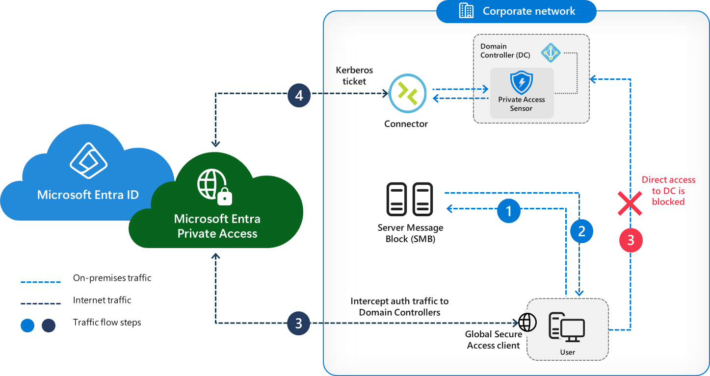

# パブリック プレビュー: ドメイン コントローラー用の Microsoft Entra Private Access

こんにちは、Azure Identity サポート チームの 五十嵐 です。

本記事は、2025 年 8 月 22 日に米国の Microsoft Entra (Azure AD) Blog で公開された [Microsoft Entra Private Access for Domain Controllers is now in Public Preview](https://techcommunity.microsoft.com/blog/microsoft-entra-blog/microsoft-entra-private-access-for-domain-controllers-is-now-in-public-preview/4440786) の抄訳です。ご不明点等ございましたらサポート チームまでお問い合わせください。

## Microsoft Entra はオンプレミス インフラの中心であるドメイン コントローラーに対して ID 中心のゼロ トラスト アクセス制御を提供します

[Microsoft Entra の Active Directory ドメイン コントローラー用の Microsoft Entra Private Access](https://learn.microsoft.com/ja-jp/entra/global-secure-access/how-to-configure-domain-controllers) がパブリック プレビューになりました。この機能は Microsoft の Security Service Edge (SSE) の一部であり、Kerberos を通じて認証される内部リソースに対して条件付きアクセスや多要素認証 (MFA) を利用できるようになります。これらは Global Secure Access によって管理されます。

ドメイン コントローラーに対して制御を強制することで、オンプレミスのリソースを二重のレイヤーで保護する、ID を中心としたゼロ トラストの保護が実現されます。これにより、社内にいるユーザーも含めて、ユーザーとドメイン コントローラーの両方のアクセスが保護されます。

## ハイブリッド環境全体で ID の制御をシームレスに適用

Microsoft Entra の Active Directory ドメイン コントローラー用の Private Access では、オンプレミス リソースに対するゼロ トラスト アクセス制御を強化するにあたり、ドメイン コントローラーに対して軽量のエージェントである「Private Access センサー」をインストールします。Private Access が Kerberos 認証に介在し、条件付きアクセス ポリシーを適用することで、旧来のプロトコルが最新の ID 制御をサポートしていなくても、ネットワーク境界内にある暗黙的な信頼を排除することが可能になるのです。このアプローチにより、リモート、オンプレミス、ハイブリッド環境全体で一貫したセキュリティが確保され、ユーザーにとって継続してシームレスな体験を提供することが可能になります。

ハイブリッド環境に存在するレガシ アプリケーションやインフラは、コードやハードウェアの変更なしに先進の ID 保護を利用できます。オンプレミス ユーザーに関しては、アプリケーションのトラフィックは引き続きそのオンプレミス環境内で処理されるためパフォーマンスを維持しつつ、認証トラフィックは Entra に送信されてポリシー評価が行われるため、セキュリティ境界全体で一貫した制御が実現されます。

さらに、ハイブリッド ユーザー向けに「Identity Threat Detection and Response (ITDR)」を有効化する大きな機会も得られます。すべてのアクセス要求を検証し、ラテラル ムーブメント (横方向の侵害拡大) を阻止し、オンプレミス アプリケーションへのローカルでのアクセス時にもドメイン コントローラーのレベルで多要素認証 (MFA) など条件付きアクセス ポリシーを適用できるようになるのです。

## ハイブリッド ワークに最適化: 一貫したゼロ トラスト ネットワーク アクセス (ZTNA)

Microsoft Entra Private Access は、オンプレミス、リモート、ハイブリッド環境全体で、一貫した ID およびネットワークのセキュリティ制御を提供します。ドメインで認証されるリソースへのすべての認証要求を条件付きアクセス ポリシーで検証することで、ユーザーの場所に関係なく、ネットワーク境界に基づく暗黙的な信頼から継続的な検証へと環境を移行可能になります。

## すべてのリソースを対象とした ID 中心のゼロ トラスト

Microsoft Entra Private Access は、重要なオンプレミス リソースに対して ID ベースの制御を追加することで、ZTNA を強化します。管理者は SPN (Service Principal Name) レベルで詳細なポリシーを設定できます。これは例えば cifs/\* ファイル共有に対して MFA を要求したり、MSSQL/\* サーバーへ準拠デバイスでのアクセスを許可したり、機密性の高い RDP サーバーに対してステップアップ認証を適用したりというものです。これにより、リスクに基づいてポリシーを分けたり、サービスへのアクセスをきめ細かく制御したりが可能になります。

## シームレスなユーザー体験と強力な制御

管理インターフェースは Microsoft Entra 管理センター内の Global Secure Access に統合されており、ドメイン コントローラーの登録、アプリケーション セグメント (SPN) の構成、条件付きアクセス ポリシーの割り当てを一元的に行えます。ポリシーは Private Access センサーに動的に配布され、再起動を必要とせず、効率的かつ一貫した適用が可能です。

このアーキテクチャは、リモート デスクトップ プロトコル (RDP) のセッション内から起動された RDP セッションなど、入れ子状の RDP セッションにおけるラテラル ムーブメント (横方向の侵害拡大) を防ぐのにも有効です。高価なオンプレミス アプライアンスの導入やアプリケーション データのクラウド経由のルーティングは必要ありません。

## 柔軟性と耐障害性を備えた設計

ドメイン コントローラー用の Microsoft Entra Private Access は、段階的に導入することも可能で、複雑な環境もサポートする以下のような機能が含まれています:

- **監査モード**: 本番運用前にポリシー適用の影響をプレビュー
- **SPN 除外設定**: レガシ システムに対して段階的に導入可能
- **非管理デバイスのブロック**: 承認されたエンドポイントへのアクセスを制限
- **ブレーク グラス モード**: 重要インフラへの緊急アクセスを許可

これらの制御により、運用を妨げることなく安心して導入できます。

## 着目ポイント

ドメイン コントローラー用の Microsoft Entra Private Access は、サードパーティ製ハードウェアや複雑なネットワーク変更なしで、オンプレミス環境に対して MFA の導入を実現します。軽量なセンサーが Kerberos 認証を傍受し、条件付きアクセスを適用することでレガシ アプリにも対応可能です。

この ID 中心の ZTNA モデルにより、機密リソースごとに明示的に再認証を要求するなどきめ細かなアクセス制御が Entra ポータル上で構成可能となり、ラテラル ムーブメント (横方向の侵害拡大) に対する防御が強化されます。ネットワークの設計を見直すことなくハイブリッド ワークや ITDR (Identity Threat Detection and Response) に対応したオンプレミス セキュリティの刷新が可能となるのです。

## 今すぐ始めましょう

Private Access センサーを展開し、ポリシーも構成することでぜひテストを開始ください。セットアップ手順については、[Microsoft Learn の構成ガイド](https://learn.microsoft.com/ja-jp/entra/global-secure-access/how-to-configure-domain-controllers) をご覧ください。

-Ashish Jain
