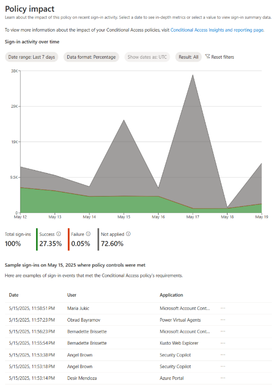
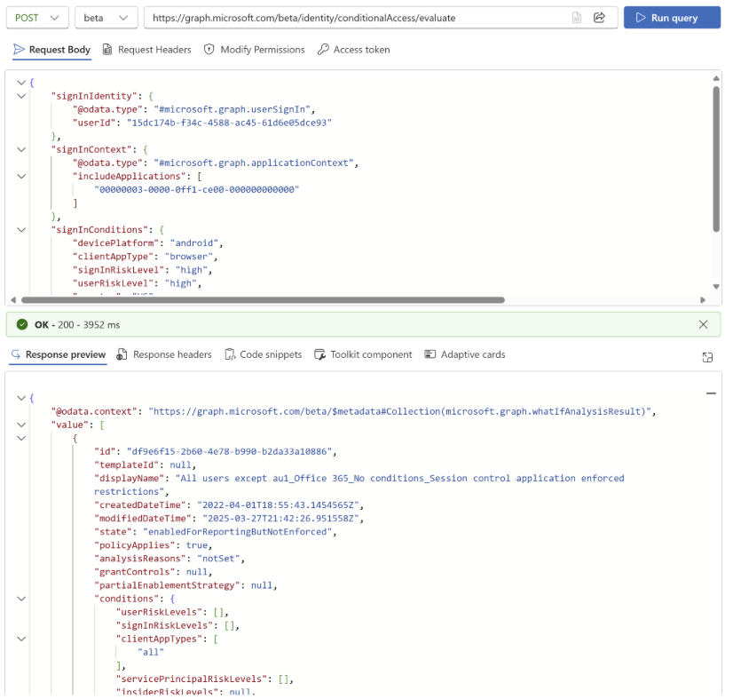
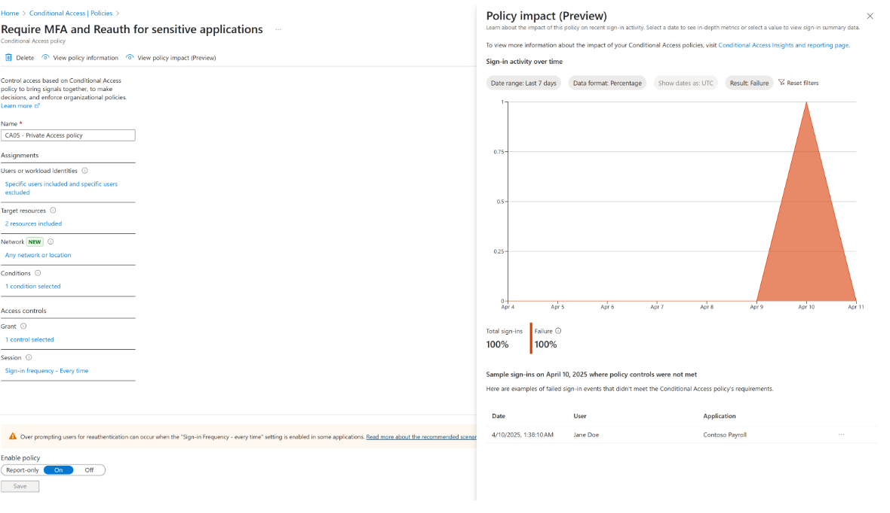
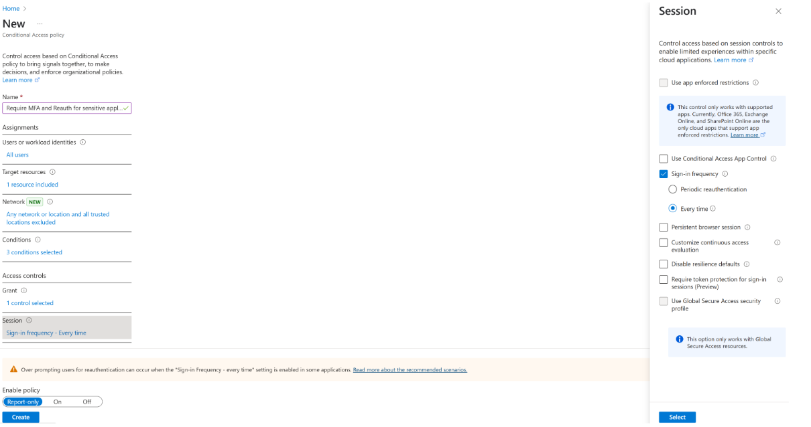

# Entra 条件付きアクセスにおける新しいポリシー強化ツール

こんにちは、Azure & Identity サポート チームです。

本記事は、2025 年 6 月 10 日に米国の Microsoft Entra Blog で公開された [New policy enhancement tools in Entra Conditional Access](https://techcommunity.microsoft.com/blog/microsoft-entra-blog/new-policy-enhancement-tools-in-entra-conditional-access/4418866) を意訳したものになります。ご不明点等ございましたらサポート チームまでお問い合わせください。

----

近年、[Storm-2372 のようなフィッシング攻撃](https://www.microsoft.com/en-us/security/blog/2025/02/13/storm-2372-conducts-device-code-phishing-campaign/) をはじめとする ID を対象にした攻撃がますます複雑化しています。攻撃者は見落とされやすい認証の流れやポリシーの抜け穴を狙って攻撃してくるため、IT 管理者にはより高度なアクセス制御ツールが必要です。そこで弊社は Microsoft Entra の条件付きアクセスにおいてポリシーの展開をより正確かつ安心して行えるよう、以下の 3 つの強力な新機能を導入しました。これらは管理者がポリシーをより正確かつ自信をもって計画し、監視し、最適化できるようデザインされたものです。それぞれのツールにはアクセス ポリシーを安全かつ効率的に、なおかつ耐障害性も考慮して運用するための独自の機能が備わっています。

- **一般提供開始**: ポリシーごとのレポート機能
- **パブリック プレビュー**: What-If 評価 API
- **一般提供開始**: サインイン頻度 – 毎回 (セッション制御)

それぞれの機能が実際にどのように動作するのか、詳しく見ていきましょう。

## ポリシーごとのレポート機能でアクセス制御の状況を分かりやすく把握

管理者が条件付きアクセス ポリシーを調整や適用する際、各ポリシーがユーザーのサインインにどのような影響を与えているかを把握することで、より適切な判断が可能になります。新たに追加された **ポリシーごとのレポート機能** を利用すると、各ポリシーが組織内のサインイン アクテビティにどのような影響を与えるかを簡単に、かつポリシー単位で確認できるようになります。ポリシーが有効かレポート専用モードかにかかわらず、わかりやすい可視化機能によりポリシーが与える影響を速やかに評価できるようになります。これにより複雑なログの解析や、追加ライセンスが必要なカスタム ワークブックに頼る必要がなくなるのです。4 月の一般提供開始以来、利用率は 475% 増加しており、多くの管理者にとってこのツールが、ポリシーの監視や調整を安心して行うために実際に役立っていることがわかります。

## What-If 評価 API でポリシーの影響を事前に確認

条件付きアクセス ポリシーの管理は、単に受動的に対応するだけでなく、先を見越して行うことが重要です。**What-If 評価 API** は、ポリシーが実際に適用される前に、その影響を大規模にシミュレーションできる強力なツールです。これにより、さまざまなサインイン シナリオに対してテストを自動化でき、ポリシー構成が組織のセキュリティ要件と常に一致していることを確認することができます。また、あまりないパターンや複雑なケースもシミュレーションできるため、より包括的で強固なポリシー設計が可能になります。この API は Microsoft Entra ポータル内の What-If 機能でも利用されており、実際のサインインと同じ認証ロジックを使って高精度な評価を実現しますので、テストで得られる結果はユーザーに対して実際に適用される制御内容と同じものになります。2025 年のパブリック プレビュー以降、この API の利用は 220% 増加しており、多くの管理者がこのツールを使ってポリシーをテストおよび調整し、安心して展開していることがわかります。

### 実際の動作を見てみる

Contoso 社が、社内の給与アプリを保護するために新しい What-If 評価 API ツールを活用し、安心して新しい条件付きアクセスポリシーを展開するというシナリオを見てみましょう。

#### ステップ 1: ポリシーを定義する

Contoso 社の ID およびアクセス管理チームは、機密性の高い従業員データを含む Contoso 給与アプリへのアクセスを保護したいと考えています。そこで、以下のようなポリシーを導入することにしました。

- 多要素認証 (MFA) の要求
- **再認証** の強制
- 信頼されていないネットワークからアプリにアクセスする **リスクのあるユーザー** を対象とする

ただし、ポリシーをすぐに強制適用するのではなく、まずはレポート専用モードで構成し、ユーザーに影響を与えずにその効果を監視することにしました。

#### ステップ 2: ポリシーを検証する

Contoso 社は、要件に沿って条件付きアクセス ポリシーを構成しましたが、ポリシーの影響を事前に確認するために、Microsoft Entra ポータル内の What-If 機能を使用することにしました。このツールを使用することで、再認証の要件が適切なシナリオで適用されることが確認できました。

#### ステップ 3: API を使ってテストを自動化する

さらに、Contoso 社のチームは API を活用してテスト プロセスを自動化することにしました。Contoso 社は What-If 評価 API を使って、手動ではテストが難しいような微妙なサインイン シナリオを含め幅広くシミュレートするスクリプトを開発しました。たとえば:

- 組織が拠点を持たない地域からユーザーがサインインするケース
- リスクのあるユーザーが信頼されたネットワーク外からアプリケーションにアクセスするケース

API はそれぞれのシナリオに対して、どのポリシーが適用されるか結果を返します。そしてこのスクリプトを毎日実行するようスケジュールし、テナント内の構成変更によってポリシーの適用にずれが生じていないかを継続的に監視できるようにしました。

#### ステップ 4: ポリシーの影響を確認し有効化する

このポリシーは過去 7 日間、レポート専用モードで運用されていたため、管理者は「ポリシーごとのレポート機能」を使ってポリシーの影響を確認しました。この機能には、ポリシーによって影響を受けたサインインの件数が詳しくまとめられています。管理者はポリシー結果のフィルターやサンプルのサインイン データを活用し、ポリシーの動作が想定どおりであることを確認します。その結果、ほとんどのサインインは成功しており、ブロックされたのは主にリスクのあるユーザーのみであることが分かりました。これは想定した結果と一致しているため、管理者はこのポリシーがセキュリティを強化しつつ、一般ユーザーに悪影響を与えないと確信し、ポリシーを正式に有効化しました。

## サインイン頻度 – 毎回

現在のデジタル環境では、機密性の高いリソースへのアクセスやコンプライアンス対応、高リスクな操作を行う際などに、ユーザーに対して繰り返し再認証を求める必要がある場合があります。これは [ゼロトラストの基本原則](https://learn.microsoft.com/ja-jp/security/zero-trust/zero-trust-overview) のひとつである明示的な検証に沿った考え方です。そこで活用できるのが、**サインイン頻度 – 毎回** というセッション制御機能です。この機能を使えば、管理者は条件付きアクセス ポリシーを通じて、対象のアプリケーションや認証コンテキストに対して毎回の対話型再認証を求める設定が可能になります。

たとえば、組織が機密性の高いアプリケーションを保護したい場合や、VPN の背後にあるリソースを守りたい場合、または Privileged Identity Management (PIM) で特権ロールの昇格を安全に行いたいなどのシナリオを想像ください。このような重要なリソースへのアクセス時に、「サインイン頻度 – 毎回のセッション制御」を導入することで、ユーザーに毎回の再認証を求めることができます。このように追加のセキュリティの層を設けることにより、トークンの盗難や不正アクセスといったリスクを軽減することができます。

## 条件付きアクセス最適化エージェントを使って新しいセキュリティ脅威にも素早く対応

攻撃者の手口が進化し続ける中、私たちの防御もそれに合わせて進化する必要があります。このため、新しくリリースされた [Microsoft Security Copilot を使用した Microsoft Entra 条件付きアクセス最適化エージェント](https://learn.microsoft.com/ja-jp/entra/identity/conditional-access/agent-optimization) (現在パブリック プレビュー中) もぜひ活用ください。この機能は AI を活用した自律型エージェントで、環境内の変化 (新しいユーザーやアプリケーションの追加など) を常時監視し、条件付きアクセスポリシーの適用漏れを検出します。さらに、ワンクリックで適用できるポリシーの改善案を提示し、ゼロ トラストのセキュリティ体制を強化します。

エージェントがポリシーの見直しポイントや改善点を自動で提案してくれるので、手作業や特別なツールなしで、組織の変化に合わせてセキュリティポリシーを常に最新の状態に保つことができます。

## ぜひお試しください

これらの条件付きアクセスの強化機能により、管理者はポリシーの計画、監視、最適化を効果的に行うための新たなツールを手にすることになります。「**条件付きアクセスのポリシーごとのレポート**」、「**What-If API**」、「**再認証**」などの機能を活用することで、ポリシーが組織のニーズに合い、なおかつ安全で効果的なものになっていることを確認いただけます。

Swaroop Krishnamurthy  
Principal Product Manager
